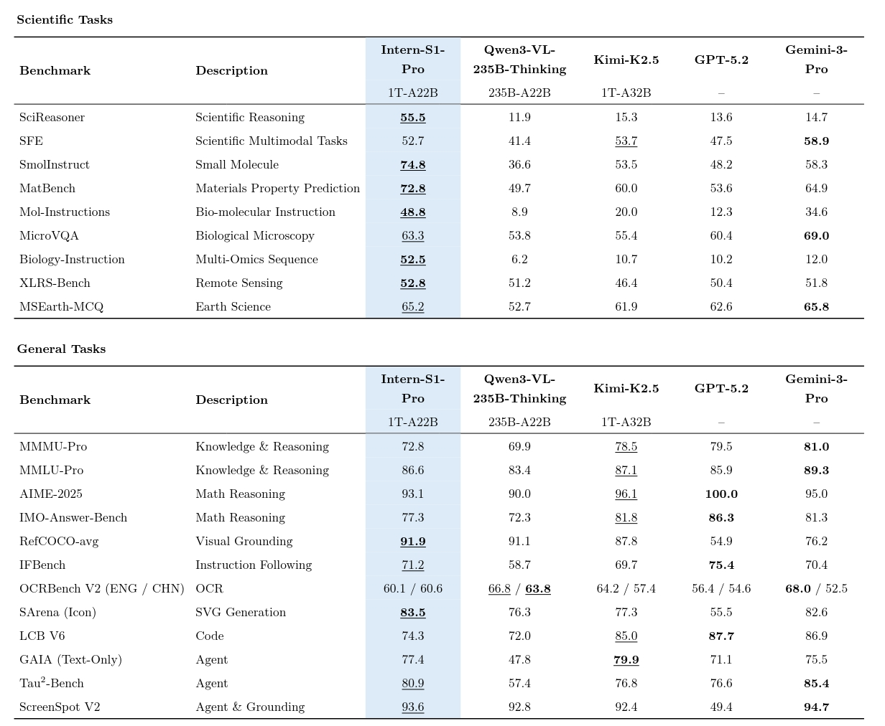

## Intern-S1

<div align="center">


<div>&nbsp;</div>

[🤗Huggingface](https://huggingface.co/collections/internlm/intern-s1-6882e325e8ac1c58ba108aa5) •  [ ModelScope](https://modelscope.cn/collections/Intern-S1-29b3100f15e240) • [📜Technical Report(S1)](https://arxiv.org/abs/2508.15763) • [📜Technical Report(S1-Pro)](https://arxiv.org/abs/2603.25040) • [💬Online Chat](https://chat.intern-ai.org.cn/)

[English](./README.md) |
[简体中文](./README_zh-CN.md)

</div>

<p align="center">
    👋 join us on <a href="https://discord.gg/xa29JuW87d" target="_blank">Discord</a> and <a href="https://cdn.vansin.top/intern-s1.jpg" target="_blank">WeChat</a>
</p>

## Introduction

We introduce **Intern-S1-Pro**, a trillion-scale MoE multimodal scientific reasoning model. Intern-S1-Pro scales to 1T total parameters with 512 experts, activating 8 experts per token (22B activated parameters). The model delivers top-tier performance on advanced reasoning benchmarks and achieves leading results across key AI4Science domains (chemistry, materials, life-science, earth, etc.), while maintaining strong general multimodal and text capabilities.

### Features

- **State-of-the-art scientific reasoning**, competitive with leading closed-source models across AI4Science tasks.

- **Strong general multimodal performance** on various benchmarks.

- **Trillion-scale MoE training efficiency** with **STE** routing (dense gradient for router training)  and **grouped routing** for stable convergence and balanced expert parallelism.

- **Fourier Position Encoding (FoPE)  + upgraded time-series modeling** for better physical signal representation; supports long, heterogeneous time-series (10^0–10^6 points).

______________________________________________________________________

<details>
    <summary>Introduction of Intern-S1 (click to expand)</summary>

We introduce **Intern-S1**, our **most advanced open-source multimodal reasoning model** to date. Intern-S1 combines **strong general-task capabilities with state-of-the-art performance on a wide range of scientific tasks**, rivaling leading closed-source commercial models.

Built upon a 235B MoE language model (Qwen3) and a 6B Vision encoder (InternViT), Intern-S1 has been further pretrained on **5 trillion tokens** of multimodal data, including over **2.5 trillion scientific-domain tokens**. This enables the model to retain strong general capabilities while excelling in specialized scientific domains such as **interpreting chemical structures, understanding protein sequences, and planning compound synthesis routes**, making Intern-S1 to be a capable research assistant for real-world scientific applications.

We also released **Intern-S1-mini**, a lightweight version of Intern-S1, which contains an 8B language model and a 0.3B vision encoder.

### Features

- Strong performance across language and vision reasoning benchmarks, especially scientific tasks.

- Continuously pretrained on a massive 5T token dataset, with over 50% specialized scientific data, embedding deep domain expertise.

- Dynamic tokenizer enables native understanding of molecular formulas, protein sequences, and seismic signals.

</details>

## Model Zoo

### Intern-S1-Pro

|                                                                    | FP8                                                                                                       |
| ------------------------------------------------------------------ | --------------------------------------------------------------------------------------------------------- |
| 🤗HuggingFace                                                      | [internlm/Intern-S1-Pro](https://huggingface.co/internlm/Intern-S1-Pro)                                   |
|  ModelScope | [Shanghai_AI_Laboratory/Intern-S1-Pro](https://modelscope.cn/models/Shanghai_AI_Laboratory/Intern-S1-Pro) |

### Intern-S1

|                                                                    | BF16                                                                                              | FP8                                                                                                       | GGUF                                                                                                        |
| ------------------------------------------------------------------ | ------------------------------------------------------------------------------------------------- | --------------------------------------------------------------------------------------------------------- | ----------------------------------------------------------------------------------------------------------- |
| 🤗HuggingFace                                                      | [internlm/Intern-S1](https://huggingface.co/internlm/Intern-S1)                                   | [internlm/Intern-S1-FP8](https://huggingface.co/internlm/Intern-S1-FP8)                                   | [internlm/Intern-S1-GGUF](https://huggingface.co/internlm/Intern-S1-GGUF)                                   |
|  ModelScope | [Shanghai_AI_Laboratory/Intern-S1](https://modelscope.cn/models/Shanghai_AI_Laboratory/Intern-S1) | [Shanghai_AI_Laboratory/Intern-S1-FP8](https://modelscope.cn/models/Shanghai_AI_Laboratory/Intern-S1-FP8) | [Shanghai_AI_Laboratory/Intern-S1-GGUF](https://modelscope.cn/models/Shanghai_AI_Laboratory/Intern-S1-GGUF) |

### Intern-S1-mini

|                                                                    | BF16                                                                                                        | FP8                                                                                                                 | GGUF                                                                                |
| ------------------------------------------------------------------ | ----------------------------------------------------------------------------------------------------------- | ------------------------------------------------------------------------------------------------------------------- | ----------------------------------------------------------------------------------- |
| 🤗HuggingFace                                                      | [internlm/Intern-S1-mini](https://huggingface.co/internlm/Intern-S1-mini)                                   | [internlm/Intern-S1-mini-FP8](https://huggingface.co/internlm/Intern-S1-mini-FP8)                                   | [internlm/Intern-S1-mini-GGUF](https://huggingface.co/internlm/Intern-S1-mini-GGUF) |
|  ModelScope | [Shanghai_AI_Laboratory/Intern-S1-mini](https://modelscope.cn/models/Shanghai_AI_Laboratory/Intern-S1-mini) | [Shanghai_AI_Laboratory/Intern-S1-mini-FP8](https://modelscope.cn/models/Shanghai_AI_Laboratory/Intern-S1-mini-FP8) | -                                                                                   |

## Performance

We evaluate the Intern-S1 on various benchmarks including general datasets and scientific datasets. We report the performance comparison with the recent VLMs and LLMs below.

### Intern-S1-Pro



> **Note**: Underline means the best performance among open-sourced models, Bold indicates the best performance among all models.

### Intern-S1

<table>
  <thead>
    <tr>
      <th rowspan="2">Benchmarks</th>
      <th colspan="2">Intern-S1</th>
      <th>InternVL3-78B</th>
      <th>Qwen2.5-VL-72B</th>
      <th>DS-R1-0528</th>
      <th>Qwen3-235B-A22B</th>
      <th>Kimi-K2-Instruct</th>
      <th>Gemini-2.5 Pro</th>
      <th>o3</th>
      <th>Grok-4</th>
    </tr>
  </thead>
  <tbody>
    <tr><td>MMLU-Pro</td><td colspan="2">83.5 ✅</td><td>73.0</td><td>72.1</td><td>83.4</td><td>82.2</td><td>82.7</td><td>86.0</td><td>85.0</td><td>85.9</td></tr>
    <tr><td>MMMU</td><td colspan="2">77.7 ✅</td><td>72.2</td><td>70.2</td><td>-</td><td>-</td><td>-</td><td>81.9</td><td>80.8</td><td>77.9</td></tr>
    <tr><td>GPQA</td><td colspan="2">77.3</td><td>49.9</td><td>49.0</td><td>80.6</td><td>71.1</td><td>77.8</td><td>83.8</td><td>83.3</td><td>87.5</td></tr>
    <tr><td>MMStar</td><td colspan="2">74.9 ✅</td><td>72.5</td><td>70.8</td><td>-</td><td>-</td><td>-</td><td>79.3</td><td>75.1</td><td>69.6</td></tr>
    <tr><td>MathVista</td><td colspan="2">81.5 👑</td><td>79.0</td><td>74.8</td><td>-</td><td>-</td><td>-</td><td>80.3</td><td>77.5</td><td>72.5</td></tr>
    <tr><td>AIME2025</td><td colspan="2">86.0</td><td>10.7</td><td>10.9</td><td>87.5</td><td>81.5</td><td>51.4</td><td>83.0</td><td>88.9</td><td>91.7</td></tr>
    <tr><td>MathVision</td><td colspan="2">62.5 ✅</td><td>43.1</td><td>38.1</td><td>-</td><td>-</td><td>-</td><td>73.0</td><td>67.7</td><td>67.3</td></tr>
    <tr><td>IFEval</td><td colspan="2">86.7</td><td>75.6</td><td>83.9</td><td>79.7</td><td>85.0</td><td>90.2</td><td>91.5</td><td>92.2</td><td>92.8</td></tr>
    <tr><td>SFE</td><td colspan="2">44.3 👑</td><td>36.2</td><td>30.5</td><td>-</td><td>-</td><td>-</td><td>43.0</td><td>37.7</td><td>31.2</td></tr>
    <tr><td>Physics</td><td colspan="2">44.0 ✅</td><td>23.1</td><td>15.7</td><td>-</td><td>-</td><td>-</td><td>40.0</td><td>47.9</td><td>42.8</td></tr>
    <tr><td>SmolInstruct</td><td colspan="2">51.0 👑</td><td>19.4</td><td>21.0</td><td>30.7</td><td>28.7</td><td>48.1</td><td>40.4</td><td>43.9</td><td>47.3</td></tr>
    <tr><td>ChemBench</td><td colspan="2">83.4 👑</td><td>61.3</td><td>61.6</td><td>75.6</td><td>75.8</td><td>75.3</td><td>82.8</td><td>81.6</td><td>83.3</td></tr>
    <tr><td>MatBench</td><td colspan="2">75.0 👑</td><td>49.3</td><td>51.5</td><td>57.7</td><td>52.1</td><td>61.7</td><td>61.7</td><td>61.6</td><td>67.9</td></tr>
    <tr><td>MicroVQA</td><td colspan="2">63.9 👑</td><td>59.1</td><td>53.0</td><td>-</td><td>-</td><td>-</td><td>63.1</td><td>58.3</td><td>59.5</td></tr>
    <tr><td>ProteinLMBench</td><td colspan="2">63.1</td><td>61.6</td><td>61.0</td><td>61.4</td><td>59.8</td><td>66.7</td><td>62.9</td><td>67.7</td><td>66.2</td></tr>
    <tr><td>MSEarthMCQ</td><td colspan="2">65.7 👑</td><td>57.2</td><td>37.6</td><td>-</td><td>-</td><td>-</td><td>59.9</td><td>61.0</td><td>58.0</td></tr>
    <tr><td>XLRS-Bench</td><td colspan="2">55.0 👑</td><td>49.3</td><td>50.9</td><td>-</td><td>-</td><td>-</td><td>45.2</td><td>43.6</td><td>45.4</td></tr>
  </tbody>
</table>

> **Note**: ✅ means the best performance among open-sourced models, 👑 indicates the best performance among all models.

### Intern-S1-mini

| Benchmarks     | Intern-S1-mini | Qwen3-8B | GLM-4.1V | MiMo-VL-7B-RL-2508 |
| -------------- | -------------- | -------- | -------- | ------------------ |
| MMLU-Pro       | **74.78**      | 73.7     | 57.1     | 73.93              |
| MMMU           | **72.33**      | -        | 69.9     | 70.4               |
| MMStar         | 65.2           | -        | 71.5     | 72.9               |
| GPQA           | **65.15**      | 62       | 50.32    | 60.35              |
| AIME2024       | **84.58**      | 76       | 36.2     | 72.6               |
| AIME2025       | **80**         | 67.3     | 32       | 64.4               |
| MathVision     | 51.41          | -        | 53.9     | 54.5               |
| MathVista      | 70.3           | -        | 80.7     | 79.4               |
| IFEval         | 81.15          | 85       | 71.53    | 71.4               |
| SFE            | 35.84          | -        | 43.2     | 43.9               |
| Physics        | **28.76**      | -        | 28.3     | 28.2               |
| SmolInstruct   | **32.2**       | 17.6     | 18.1     | 16.11              |
| ChemBench      | **76.47**      | 61.1     | 56.2     | 66.78              |
| MatBench       | **61.55**      | 45.24    | 54.3     | 46.9               |
| MicroVQA       | **56.62**      | -        | 50.2     | 50.96              |
| ProteinLMBench | 58.47          | 59.1     | 58.3     | 59.8               |
| MSEarthMCQ     | **58.12**      | -        | 50.3     | 47.3               |
| XLRS-Bench     | **51.63**      | -        | 49.8     | 12.29              |

We use the [OpenCompass](https://github.com/open-compass/OpenCompass/) and [VLMEvalKit](https://github.com/open-compass/vlmevalkit) to evaluate all models.
Please refer to [this page](https://opencompass.readthedocs.io/en/latest/user_guides/interns1.html) to quickly start the text-only evaluation task.

## User Guide

InternS1 can be deployed using any of the following LLM inference frameworks:

- LMDeploy
- vLLM
- SGLang

Detailed deployment examples for these frameworks are available in the

- [Intern-S1-Pro Model User Guide](docs/interns1pro_user_guide.md)
- [Intern-S1 & Intern-S1-Mini Model User Guide](docs/interns1_user_guide.md)

## Fine-tuning

See this [documentation](docs/sft.md) for more details.

## License

This project is released under the Apache 2.0 license.

## Citation

If you find this work useful, feel free to give us a cite.

```
@misc{bai2025interns1scientificmultimodalfoundation,
      title={Intern-S1: A Scientific Multimodal Foundation Model},
      author={Lei Bai and Zhongrui Cai and Maosong Cao and Weihan Cao and Chiyu Chen and Haojiong Chen and Kai Chen and Pengcheng Chen and Ying Chen and Yongkang Chen and Yu Cheng and Yu Cheng and Pei Chu and Tao Chu and Erfei Cui and Ganqu Cui and Long Cui and Ziyun Cui and Nianchen Deng and Ning Ding and Nanqin Dong and Peijie Dong and Shihan Dou and Sinan Du and Haodong Duan and Caihua Fan and Ben Gao and Changjiang Gao and Jianfei Gao and Songyang Gao and Yang Gao and Zhangwei Gao and Jiaye Ge and Qiming Ge and Lixin Gu and Yuzhe Gu and Aijia Guo and Qipeng Guo and Xu Guo and Conghui He and Junjun He and Yili Hong and Siyuan Hou and Caiyu Hu and Hanglei Hu and Jucheng Hu and Ming Hu and Zhouqi Hua and Haian Huang and Junhao Huang and Xu Huang and Zixian Huang and Zhe Jiang and Lingkai Kong and Linyang Li and Peiji Li and Pengze Li and Shuaibin Li and Tianbin Li and Wei Li and Yuqiang Li and Dahua Lin and Junyao Lin and Tianyi Lin and Zhishan Lin and Hongwei Liu and Jiangning Liu and Jiyao Liu and Junnan Liu and Kai Liu and Kaiwen Liu and Kuikun Liu and Shichun Liu and Shudong Liu and Wei Liu and Xinyao Liu and Yuhong Liu and Zhan Liu and Yinquan Lu and Haijun Lv and Hongxia Lv and Huijie Lv and Qidang Lv and Ying Lv and Chengqi Lyu and Chenglong Ma and Jianpeng Ma and Ren Ma and Runmin Ma and Runyuan Ma and Xinzhu Ma and Yichuan Ma and Zihan Ma and Sixuan Mi and Junzhi Ning and Wenchang Ning and Xinle Pang and Jiahui Peng and Runyu Peng and Yu Qiao and Jiantao Qiu and Xiaoye Qu and Yuan Qu and Yuchen Ren and Fukai Shang and Wenqi Shao and Junhao Shen and Shuaike Shen and Chunfeng Song and Demin Song and Diping Song and Chenlin Su and Weijie Su and Weigao Sun and Yu Sun and Qian Tan and Cheng Tang and Huanze Tang and Kexian Tang and Shixiang Tang and Jian Tong and Aoran Wang and Bin Wang and Dong Wang and Lintao Wang and Rui Wang and Weiyun Wang and Wenhai Wang and Yi Wang and Ziyi Wang and Ling-I Wu and Wen Wu and Yue Wu and Zijian Wu and Linchen Xiao and Shuhao Xing and Chao Xu and Huihui Xu and Jun Xu and Ruiliang Xu and Wanghan Xu and GanLin Yang and Yuming Yang and Haochen Ye and Jin Ye and Shenglong Ye and Jia Yu and Jiashuo Yu and Jing Yu and Fei Yuan and Bo Zhang and Chao Zhang and Chen Zhang and Hongjie Zhang and Jin Zhang and Qiaosheng Zhang and Qiuyinzhe Zhang and Songyang Zhang and Taolin Zhang and Wenlong Zhang and Wenwei Zhang and Yechen Zhang and Ziyang Zhang and Haiteng Zhao and Qian Zhao and Xiangyu Zhao and Xiangyu Zhao and Bowen Zhou and Dongzhan Zhou and Peiheng Zhou and Yuhao Zhou and Yunhua Zhou and Dongsheng Zhu and Lin Zhu and Yicheng Zou},
      year={2025},
      eprint={2508.15763},
      archivePrefix={arXiv},
      primaryClass={cs.LG},
      url={https://arxiv.org/abs/2508.15763},
}
```

```
@misc{zou2026interns1proscientificmultimodalfoundation,
      title={Intern-S1-Pro: Scientific Multimodal Foundation Model at Trillion Scale}, 
      author={Yicheng Zou and Dongsheng Zhu and Lin Zhu and Tong Zhu and Yunhua Zhou and Peiheng Zhou and Xinyu Zhou and Dongzhan Zhou and Zhiwang Zhou and Yuhao Zhou and Bowen Zhou and Zhanping Zhong and Zhijie Zhong and Haiteng Zhao and Penghao Zhao and Xiaomeng Zhao and Zhiyuan Zhao and Yechen Zhang and Jin Zhang and Wenwei Zhang and Hongjie Zhang and Zhuo Zhang and Wenlong Zhang and Bo Zhang and Chao Zhang and Chen Zhang and Yuhang Zang and Fei Yuan and Jiakang Yuan and Jiashuo Yu and Jinhui Yin and Haochen Ye and Qian Yao and Bowen Yang and Danni Yang and Kaichen Yang and Ziang Yan and Jun Xu and Yicheng Xu and Wanghan Xu and Xuenan Xu and Chao Xu and Ruiliang Xu and Shuhao Xing and Long Xing and Xinchen Xie and Ling-I Wu and Zijian Wu and Zhenyu Wu and Lijun Wu and Yue Wu and Jianyu Wu and Wen Wu and Fan Wu and Xilin Wei and Qi Wei and Bingli Wang and Rui Wang and Ziyi Wang and Zun Wang and Yi Wang and Haomin Wang and Yizhou Wang and Lintao Wang and Yiheng Wang and Longjiang Wang and Bin Wang and Jian Tong and Zhongbo Tian and Huanze Tang and Chen Tang and Shixiang Tang and Yu Sun and Qiushi Sun and Xuerui Su and Qisheng Su and Chenlin Su and Demin Song and Jin Shi and Fukai Shang and Yuchen Ren and Pengli Ren and Xiaoye Qu and Yuan Qu and Jiantao Qiu and Yu Qiao and Runyu Peng and Tianshuo Peng and Jiahui Peng and Qizhi Pei and Zhuoshi Pan and Linke Ouyang and Wenchang Ning and Yichuan Ma and Zerun Ma and Ningsheng Ma and Runyuan Ma and Chengqi Lyu and Haijun Lv and Han Lv and Lindong Lu and Kuikun Liu and Jiangning Liu and Yuhong Liu and Kai Liu and Hongwei Liu and Zhoumianze Liu and Mengjie Liu and Ziyu Liu and Wenran Liu and Yang Liu and Liwei Liu and Kaiwen Liu and Junyao Lin and Junming Lin and Tianyang Lin and Dahua Lin and Jianze Liang and Linyang Li and Peiji Li and Zonglin Li and Zehao Li and Pengze Li and Guoyan Li and Lingkai Kong and Linglin Jing and Zhenjiang Jin and Feifei Jiang and Qian Jiang and Junhao Huang and Zixian Huang and Haian Huang and Zhouqi Hua and Han Hu and Linfeng Hou and Yinan He and Conghui He and Tianyao He and Xu Guo and Qipeng Guo and Aijia Guo and Yuzhe Gu and Lixin Gu and Jingyang Gong and Qiming Ge and Jiaye Ge and Songyang Gao and Jianfei Gao and Xinyu Fang and Caihua fan and Yue Fan and Yanhui Duan and Zichen Ding and Shengyuan Ding and Xuanlang Dai and Erfei Cui and Ganqu Cui and Pei Chu and Tao Chu and Guangran Cheng and Yu Cheng and Kai Chen and Yongkang Chen and Chiyu Chen and Guanzhou Chen and Qiaosheng Chen and Sitao Chen and Xin Chen and Haojiong Chen and Yicheng Chen and Weihan Cao and Yuhang Cao and Qinglong Cao and Lei Bai},
      year={2026},
      eprint={2603.25040},
      archivePrefix={arXiv},
      primaryClass={cs.LG},
      url={https://arxiv.org/abs/2603.25040}, 
}
```
