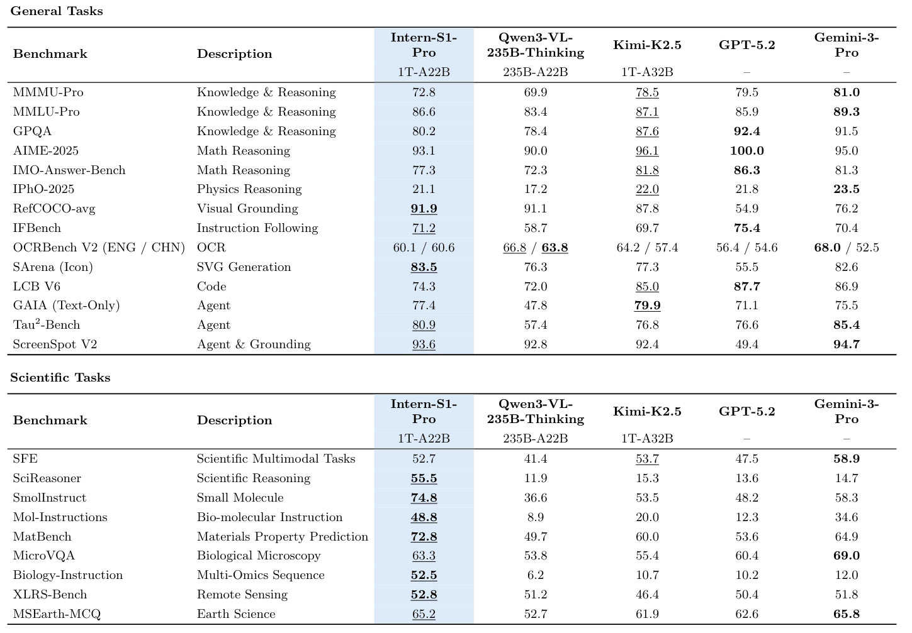

## 书生 Intern-S1

<div align="center">


<div>&nbsp;</div>

[🤗Huggingface](https://huggingface.co/collections/internlm/intern-s1-6882e325e8ac1c58ba108aa5) •  [ ModelScope](https://modelscope.cn/collections/Intern-S1-29b3100f15e240) • [📜技术报告)](https://arxiv.org/abs/2508.15763) • [💬在线体验](https://chat.intern-ai.org.cn/)

[English](./README.md) |
[简体中文](./README_zh-CN.md)

</div>

<p align="center">
    👋 join us on <a href="https://discord.gg/xa29JuW87d" target="_blank">Discord</a> and <a href="https://cdn.vansin.top/intern-s1.jpg" target="_blank">WeChat</a>
</p>

## 简介

我们推出 **Intern-S1-Pro**，这是一款万亿级参数规模的混合专家（MoE）多模态科学推理模型。Intern-S1-Pro将模型参数扩展至1T，拥有512个专家，并在推理时每个token激活8个专家（22B激活参数）。该模型在复杂推理评测中表现出了顶尖的性能，在关键的AI4Science领域（如化学、材料科学、生命科学、地球科学等）取得领先的同时也保持着强大的通用多模态与文本处理能力。

### 核心特性

- **领先的科学推理能力**：在AI4Science任务中与超过或比肩顶尖闭源模型性能
- **通用多模态性能卓越**：在各类基准测试中表现强劲
- **万亿级MoE高效训练**：采用 **STE路由机制**（路由训练使用稠密梯度）加速收敛； **分组路由策略** 实现专家并行下的负载均衡
- **傅里叶位置编码（FoPE） + 时序建模**：让模型敏锐捕捉物理信号的频谱特征；能够统一处理从10^0到10^6采样点的多通道高维信号

______________________________________________________________________

<details>
    <summary>Introduction of Intern-S1 (click to expand)</summary>

我们推出了 **Intern-S1**，这是我们推出的**最先进的开源多模态推理模型**。Intern-S1 在具备强大通用任务能力的同时，在广泛的**科学任务中也达到了最先进的性能**，可与最先进的闭源商业模型相媲美。

Intern-S1 基于一个 235B 的 MoE 语言模型 (Qwen3) 和一个 6B 的视觉编码器 (InternViT) 构建，并在 **5T token** 的多模态数据上进行了续训，其中包含**超过 2.5T 的科学领域 token**。这一训练策略使得该模型不仅保留了强大的通用能力，还在专业科学任务上表现出色，例如**解析化学结构、理解蛋白质序列、规划化合物合成路径**，使 Intern-S1 成为了能够应对真实科研任务的 AI 助手。

另外，我们还推出了 **Intern-S1-mini**，这是一个使用了 Intern-S1 同样训练技术的轻量级模型，包含一个 8B 的语言模型和一个 0.3B 的视觉编码器。

### 特性

- 在语言与视觉推理基准测试中表现强劲，尤其擅长科学任务。

- 在包含超过 50% 科学专业数据的 5T 规模数据集上持续预训练，深度融合专业领域知识。

- 动态分词器原生支持对分子式、蛋白质序列、地震信号等数据的理解。

</details>

## 模型库

### Intern-S1-Pro

|                                                                    | FP8                                                                                                       |
| ------------------------------------------------------------------ | --------------------------------------------------------------------------------------------------------- |
| 🤗HuggingFace                                                      | [internlm/Intern-S1-Pro](https://huggingface.co/internlm/Intern-S1-Pro)                                   |
|  ModelScope | [Shanghai_AI_Laboratory/Intern-S1-Pro](https://modelscope.cn/models/Shanghai_AI_Laboratory/Intern-S1-Pro) |

### Intern-S1

|                                                                    | BF16                                                                                              | FP8                                                                                                       | GGUF                                                                                                        |
| ------------------------------------------------------------------ | ------------------------------------------------------------------------------------------------- | --------------------------------------------------------------------------------------------------------- | ----------------------------------------------------------------------------------------------------------- |
| 🤗HuggingFace                                                      | [internlm/Intern-S1](https://huggingface.co/internlm/Intern-S1)                                   | [internlm/Intern-S1-FP8](https://huggingface.co/internlm/Intern-S1-FP8)                                   | [internlm/Intern-S1-GGUF](https://huggingface.co/internlm/Intern-S1-GGUF)                                   |
|  ModelScope | [Shanghai_AI_Laboratory/Intern-S1](https://modelscope.cn/models/Shanghai_AI_Laboratory/Intern-S1) | [Shanghai_AI_Laboratory/Intern-S1-FP8](https://modelscope.cn/models/Shanghai_AI_Laboratory/Intern-S1-FP8) | [Shanghai_AI_Laboratory/Intern-S1-GGUF](https://modelscope.cn/models/Shanghai_AI_Laboratory/Intern-S1-GGUF) |

### Intern-S1-mini

|                                                                    | BF16                                                                                                        | FP8                                                                                                                 | GGUF                                                                                |
| ------------------------------------------------------------------ | ----------------------------------------------------------------------------------------------------------- | ------------------------------------------------------------------------------------------------------------------- | ----------------------------------------------------------------------------------- |
| 🤗HuggingFace                                                      | [internlm/Intern-S1-mini](https://huggingface.co/internlm/Intern-S1-mini)                                   | [internlm/Intern-S1-mini-FP8](https://huggingface.co/internlm/Intern-S1-mini-FP8)                                   | [internlm/Intern-S1-mini-GGUF](https://huggingface.co/internlm/Intern-S1-mini-GGUF) |
|  ModelScope | [Shanghai_AI_Laboratory/Intern-S1-mini](https://modelscope.cn/models/Shanghai_AI_Laboratory/Intern-S1-mini) | [Shanghai_AI_Laboratory/Intern-S1-mini-FP8](https://modelscope.cn/models/Shanghai_AI_Laboratory/Intern-S1-mini-FP8) | -                                                                                   |

## 性能评估

我们在多个通用数据集和科学数据集上评估了 Intern-S1 的表现，并与近期的视觉语言模型（VLMs）和大语言模型（LLMs）进行了对比，结果如下表所示。

### Intern-S1-Pro



> **注意**: 下划线表示在开源模型中取得最优， 加粗表示在所有模型中取得最优。

### Intern-S1

<table>
  <thead>
    <tr>
      <th rowspan="2">评测集</th>
      <th colspan="2">Intern-S1</th>
      <th>InternVL3-78B</th>
      <th>Qwen2.5-VL-72B</th>
      <th>DS-R1-0528</th>
      <th>Qwen3-235B-A22B</th>
      <th>Kimi-K2-Instruct</th>
      <th>Gemini-2.5 Pro</th>
      <th>o3</th>
      <th>Grok-4</th>
    </tr>
  </thead>
  <tbody>
    <tr><td>MMLU-Pro</td><td colspan="2">83.5 ✅</td><td>73.0</td><td>72.1</td><td>83.4</td><td>82.2</td><td>82.7</td><td>86.0</td><td>85.0</td><td>85.9</td></tr>
    <tr><td>MMMU</td><td colspan="2">77.7 ✅</td><td>72.2</td><td>70.2</td><td>-</td><td>-</td><td>-</td><td>81.9</td><td>80.8</td><td>77.9</td></tr>
    <tr><td>GPQA</td><td colspan="2">77.3</td><td>49.9</td><td>49.0</td><td>80.6</td><td>71.1</td><td>77.8</td><td>83.8</td><td>83.3</td><td>87.5</td></tr>
    <tr><td>MMStar</td><td colspan="2">74.9 ✅</td><td>72.5</td><td>70.8</td><td>-</td><td>-</td><td>-</td><td>79.3</td><td>75.1</td><td>69.6</td></tr>
    <tr><td>MathVista</td><td colspan="2">81.5 👑</td><td>79.0</td><td>74.8</td><td>-</td><td>-</td><td>-</td><td>80.3</td><td>77.5</td><td>72.5</td></tr>
    <tr><td>AIME2025</td><td colspan="2">86.0</td><td>10.7</td><td>10.9</td><td>87.5</td><td>81.5</td><td>51.4</td><td>83.0</td><td>88.9</td><td>91.7</td></tr>
    <tr><td>MathVision</td><td colspan="2">62.5 ✅</td><td>43.1</td><td>38.1</td><td>-</td><td>-</td><td>-</td><td>73.0</td><td>67.7</td><td>67.3</td></tr>
    <tr><td>IFEval</td><td colspan="2">86.7</td><td>75.6</td><td>83.9</td><td>79.7</td><td>85.0</td><td>90.2</td><td>91.5</td><td>92.2</td><td>92.8</td></tr>
    <tr><td>SFE</td><td colspan="2">44.3 👑</td><td>36.2</td><td>30.5</td><td>-</td><td>-</td><td>-</td><td>43.0</td><td>37.7</td><td>31.2</td></tr>
    <tr><td>Physics</td><td colspan="2">44.0 ✅</td><td>23.1</td><td>15.7</td><td>-</td><td>-</td><td>-</td><td>40.0</td><td>47.9</td><td>42.8</td></tr>
    <tr><td>SmolInstruct</td><td colspan="2">51.0 👑</td><td>19.4</td><td>21.0</td><td>30.7</td><td>28.7</td><td>48.1</td><td>40.4</td><td>43.9</td><td>47.3</td></tr>
    <tr><td>ChemBench</td><td colspan="2">83.4 👑</td><td>61.3</td><td>61.6</td><td>75.6</td><td>75.8</td><td>75.3</td><td>82.8</td><td>81.6</td><td>83.3</td></tr>
    <tr><td>MatBench</td><td colspan="2">75.0 👑</td><td>49.3</td><td>51.5</td><td>57.7</td><td>52.1</td><td>61.7</td><td>61.7</td><td>61.6</td><td>67.9</td></tr>
    <tr><td>MicroVQA</td><td colspan="2">63.9 👑</td><td>59.1</td><td>53.0</td><td>-</td><td>-</td><td>-</td><td>63.1</td><td>58.3</td><td>59.5</td></tr>
    <tr><td>ProteinLMBench</td><td colspan="2">63.1</td><td>61.6</td><td>61.0</td><td>61.4</td><td>59.8</td><td>66.7</td><td>62.9</td><td>67.7</td><td>66.2</td></tr>
    <tr><td>MSEarthMCQ</td><td colspan="2">65.7 👑</td><td>57.2</td><td>37.6</td><td>-</td><td>-</td><td>-</td><td>59.9</td><td>61.0</td><td>58.0</td></tr>
    <tr><td>XLRS-Bench</td><td colspan="2">55.0 👑</td><td>49.3</td><td>50.9</td><td>-</td><td>-</td><td>-</td><td>45.2</td><td>43.6</td><td>45.4</td></tr>
  </tbody>
</table>

> **注意**: ✅ 表示在开源模型中取得最优， 👑 表示在所有模型中取得最优。

### Intern-S1-mini

| 评测集         | Intern-S1-mini | Qwen3-8B | GLM-4.1V | MiMo-VL-7B-RL-2508 |
| -------------- | -------------- | -------- | -------- | ------------------ |
| MMLU-Pro       | **74.78**      | 73.7     | 57.1     | 73.93              |
| MMMU           | **72.33**      | -        | 69.9     | 70.4               |
| MMStar         | 65.2           | -        | 71.5     | 72.9               |
| GPQA           | **65.15**      | 62       | 50.32    | 60.35              |
| AIME2024       | **84.58**      | 76       | 36.2     | 72.6               |
| AIME2025       | **80**         | 67.3     | 32       | 64.4               |
| MathVision     | 51.41          | -        | 53.9     | 54.5               |
| MathVista      | 70.3           | -        | 80.7     | 79.4               |
| IFEval         | 81.15          | 85       | 71.53    | 71.4               |
| SFE            | 35.84          | -        | 43.2     | 43.9               |
| Physics        | **28.76**      | -        | 28.3     | 28.2               |
| SmolInstruct   | **32.2**       | 17.6     | 18.1     | 16.11              |
| ChemBench      | **76.47**      | 61.1     | 56.2     | 66.78              |
| MatBench       | **61.55**      | 45.24    | 54.3     | 46.9               |
| MicroVQA       | **56.62**      | -        | 50.2     | 50.96              |
| ProteinLMBench | 58.47          | 59.1     | 58.3     | 59.8               |
| MSEarthMCQ     | **58.12**      | -        | 50.3     | 47.3               |
| XLRS-Bench     | **51.63**      | -        | 49.8     | 12.29              |

评估使用了 [OpenCompass](https://github.com/open-compass/OpenCompass/) 和 [VLMEvalKit](https://github.com/open-compass/vlmevalkit)。请参阅 [此界面](https://opencompass.readthedocs.io/zh-cn/latest/user_guides/interns1.html) 来快速启动文本评测任务。

## 使用指南

InternS1 能够使用以下推理框架进行部署:

- LMDeploy
- vLLM
- SGLang

具体的使用示例和教程请参考以下文档

- [Intern-S1-Pro 模型使用指南](docs/interns1pro_user_guide_zh-CN.md)
- [Intern-S1 & Intern-S1-Mini 模型使用指南](docs/interns1_user_guide_zh-CN.md)

## 微调

请参考 [这篇文档](docs/sft.md) 了解微调模型的详细步骤。

## 开源协议

该项目使用 Apache 2.0 开源协议。

## 引用

如果你觉得这项工作对你有帮助，请引用我们的技术报告：

```
@misc{bai2025interns1scientificmultimodalfoundation,
      title={Intern-S1: A Scientific Multimodal Foundation Model},
      author={Lei Bai and Zhongrui Cai and Maosong Cao and Weihan Cao and Chiyu Chen and Haojiong Chen and Kai Chen and Pengcheng Chen and Ying Chen and Yongkang Chen and Yu Cheng and Yu Cheng and Pei Chu and Tao Chu and Erfei Cui and Ganqu Cui and Long Cui and Ziyun Cui and Nianchen Deng and Ning Ding and Nanqin Dong and Peijie Dong and Shihan Dou and Sinan Du and Haodong Duan and Caihua Fan and Ben Gao and Changjiang Gao and Jianfei Gao and Songyang Gao and Yang Gao and Zhangwei Gao and Jiaye Ge and Qiming Ge and Lixin Gu and Yuzhe Gu and Aijia Guo and Qipeng Guo and Xu Guo and Conghui He and Junjun He and Yili Hong and Siyuan Hou and Caiyu Hu and Hanglei Hu and Jucheng Hu and Ming Hu and Zhouqi Hua and Haian Huang and Junhao Huang and Xu Huang and Zixian Huang and Zhe Jiang and Lingkai Kong and Linyang Li and Peiji Li and Pengze Li and Shuaibin Li and Tianbin Li and Wei Li and Yuqiang Li and Dahua Lin and Junyao Lin and Tianyi Lin and Zhishan Lin and Hongwei Liu and Jiangning Liu and Jiyao Liu and Junnan Liu and Kai Liu and Kaiwen Liu and Kuikun Liu and Shichun Liu and Shudong Liu and Wei Liu and Xinyao Liu and Yuhong Liu and Zhan Liu and Yinquan Lu and Haijun Lv and Hongxia Lv and Huijie Lv and Qidang Lv and Ying Lv and Chengqi Lyu and Chenglong Ma and Jianpeng Ma and Ren Ma and Runmin Ma and Runyuan Ma and Xinzhu Ma and Yichuan Ma and Zihan Ma and Sixuan Mi and Junzhi Ning and Wenchang Ning and Xinle Pang and Jiahui Peng and Runyu Peng and Yu Qiao and Jiantao Qiu and Xiaoye Qu and Yuan Qu and Yuchen Ren and Fukai Shang and Wenqi Shao and Junhao Shen and Shuaike Shen and Chunfeng Song and Demin Song and Diping Song and Chenlin Su and Weijie Su and Weigao Sun and Yu Sun and Qian Tan and Cheng Tang and Huanze Tang and Kexian Tang and Shixiang Tang and Jian Tong and Aoran Wang and Bin Wang and Dong Wang and Lintao Wang and Rui Wang and Weiyun Wang and Wenhai Wang and Yi Wang and Ziyi Wang and Ling-I Wu and Wen Wu and Yue Wu and Zijian Wu and Linchen Xiao and Shuhao Xing and Chao Xu and Huihui Xu and Jun Xu and Ruiliang Xu and Wanghan Xu and GanLin Yang and Yuming Yang and Haochen Ye and Jin Ye and Shenglong Ye and Jia Yu and Jiashuo Yu and Jing Yu and Fei Yuan and Bo Zhang and Chao Zhang and Chen Zhang and Hongjie Zhang and Jin Zhang and Qiaosheng Zhang and Qiuyinzhe Zhang and Songyang Zhang and Taolin Zhang and Wenlong Zhang and Wenwei Zhang and Yechen Zhang and Ziyang Zhang and Haiteng Zhao and Qian Zhao and Xiangyu Zhao and Xiangyu Zhao and Bowen Zhou and Dongzhan Zhou and Peiheng Zhou and Yuhao Zhou and Yunhua Zhou and Dongsheng Zhu and Lin Zhu and Yicheng Zou},
      year={2025},
      eprint={2508.15763},
      archivePrefix={arXiv},
      primaryClass={cs.LG},
      url={https://arxiv.org/abs/2508.15763},
}
```
